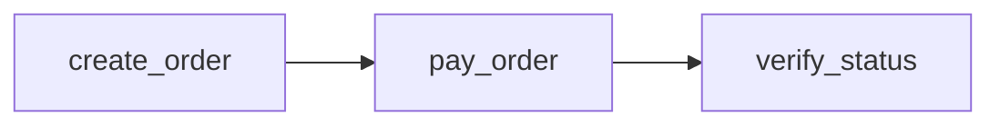
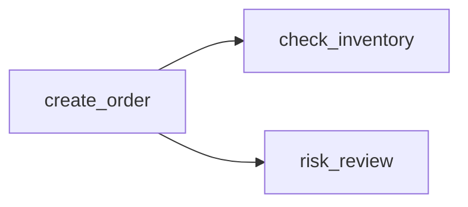
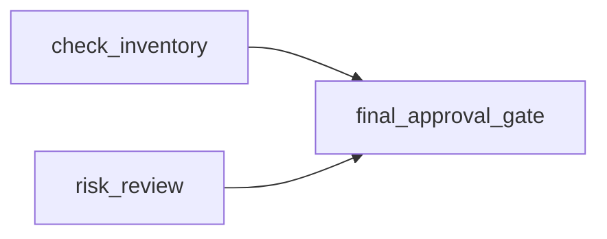

# E2E DAG 工作流用例设计与编排规范指南

本技能（Skill）旨在指导工程师与 AI 智能体规范化编写基于 **DAG（有向无环图）** 的端到端自动化测试工作流（Test as Code）。

---

## 1. 核心架构与设计理念

E2E DAG 测试编排框架将复杂的业务全链路测试用例抽象为有向无环图：
- **声明式拓扑**：无需手动计算画布物理坐标或连线，通过节点的 `dependsOn` 声明上游依赖，调度引擎与前端自动完成拓扑分层（Rank）、并发调度与连线渲染。
- **三层变量作用域**：
  1. **全局用例变量池 (`variables`)**：顶层定义的固定或环境配置变量，整个用例全局共享。
  2. **节点运行时输出 (`output`)**：节点执行完成后通过 `extract` 捕获的动态上下文，供给下游节点消费。
  3. **内置运行时元数据**：如各节点执行状态 `{{ <nodeId>.status }}` 等。

---

## 2. 顶级工作流结构 (Root Spec)

```yaml
id: order_reconciliation_workflow    # 必填：工作流全局唯一英文标识 (snake_case)
name: "订单交易与账本核销全链路核对"    # 必填：用例中文可读名称
module: "交易履约引擎"                 # 必填：所属业务域/微服务模块
priority: "P0"                       # 必填：用例优先级 (P0 / P1 / P2 / P3)
description: "模拟用户下单、账户扣款，并通过 SQL 与门禁核销账本" # 选填：用例背景说明

# 1. 用例变量池 (统一规范为 variables，严禁使用易混淆的 params)
variables:
  userId: "usr_9527_vip"
  merchantId: "mch_8888"
  currency: "CNY"
  expectedDeduction: 99.00
  threshold: 1000

# 2. DAG 节点列表
nodes:
  - id: create_order
    # ...
```

> [!IMPORTANT]
> **关于 `variables` 术语规范**：
> 顶级变量池统一使用 **`variables`**（兼容简写 `vars`）。**严禁使用 `params`**，因为 `params` 在接口测试场景通常代指 HTTP Query Params（如 `?userId=123`），用作全局变量极易引发歧义。

---

## 3. 变量池与插值语法 (Variables & Interpolation)

整个工作流支持基于 Mustache 双大括号 `{{ ... }}` 的统一变量插值解析：

| 取值来源 | 语法格式 | 示例 | 说明 |
| :--- | :--- | :--- | :--- |
| **用例变量池** | `{{ variables.<key> }}` | `{{ variables.userId }}` | 推荐标准写法 |
| **用例变量池(简写)** | `{{ vars.<key> }}` | `{{ vars.merchantId }}` | 极简写法 |
| **上游节点输出** | `{{ <nodeId>.output.<key> }}` | `{{ create_order.output.orderId }}` | 消费上游节点 `extract` 捕获的值 |
| **节点运行状态** | `{{ <nodeId>.status }}` | `{{ query_wallet.status }}` | 取值为 `SUCCESS`, `FAILURE`, `RUNNING` 等 |

### 变量插值支持的位置：
- HTTP 请求：`url`、`headers`、`params` (Query 参数)、`body` (支持局部插值或整段 JSON 插值)；
- SQL 执行：SQL 模板文本（如 `WHERE user_id = '{{ variables.userId }}'`）；
- 质量门禁：`condition` 逻辑表达式与判断规则；
- 节点断言：`assertions[].expected` 预期值。

---

## 4. 节点类型规范 (Node Types)

系统目前原生支持三类核心工作流节点：

### 4.1 HTTP 节点 (`type: HTTP`)
用于调用微服务 RESTful API、网关接口或第三方 Webhook。

```yaml
- id: create_order
  name: "创建商品订单"
  type: HTTP
  dependsOn: []                     # 根节点无上游依赖
  config:
    url: "/api/v1/orders"
    method: "POST"
    headers:
      Content-Type: "application/json"
      X-User-Id: "{{ variables.userId }}"
    body:
      userId: "{{ variables.userId }}"
      merchantId: "{{ variables.merchantId }}"
      amount: "{{ variables.expectedDeduction }}"
      currency: "{{ variables.currency }}"
    extract:                        # 捕获响应体字段注入到当前节点的 output 中
      orderId: "data.order_id"
      bizSn: "data.biz_serial_no"
    assertions:                     # 响应断言
      - field: "status_code"
        operator: "equals"
        expected: 200
      - field: "data.status"
        operator: "equals"
        expected: "CREATED"
```

### 4.2 SQL 节点 (`type: SQL`)
用于在数据库层验证落库状态、流水记录、扣减金额等（支持数据状态强校验与前置清理）。

```yaml
- id: verify_ledger_entry
  name: "核对账本记账流水"
  type: SQL
  dependsOn:
    - create_order                  # 依赖订单创建完成
  config:
    datasource: "finance_ledger_db"
    sql: >-
      SELECT amount, status, account_id 
      FROM t_ledger_flow 
      WHERE order_id = '{{ create_order.output.orderId }}' 
      LIMIT 1;
    extract:
      deductedAmount: "amount"      # 提取 SQL 查询结果首行的 amount 列
      flowStatus: "status"
    assertions:
      - field: "amount"
        operator: "equals"
        expected: "{{ variables.expectedDeduction }}"
      - field: "status"
        operator: "equals"
        expected: "SETTLED"
```

### 4.3 质量门禁节点 (`type: QUALITY_GATE`)
用于多路汇聚控制、资金安全准入、熔断检查或业务一致性门禁。门禁失败将阻断后续下游执行。

```yaml
- id: financial_safety_gate
  name: "资金安全准入门禁"
  type: QUALITY_GATE
  dependsOn:
    - verify_ledger_entry           # 汇聚上游单路或多路
    - query_wallet_balance
  config:
    rule: "DOUBLE_ENTRY_CHECK"
    condition: "{{ verify_ledger_entry.output.flowStatus }} == 'SETTLED' && {{ query_wallet_balance.output.balance }} >= 0"
    timeoutSeconds: 30
```

---

## 5. DAG 依赖与拓扑连线最佳实践 (`dependsOn`)

### 5.1 连线与依赖原理
- 编排 YAML 中 **不需要也不应该手动维护物理连线坐标或连线对象**。
- 节点通过 `dependsOn: [ "上游节点ID" ]` 显式声明前置依赖关系。
- 平台调度引擎将按有向图自动进行拓扑排序（Kahn 算法）与层级推进；
- 前端可视化工作流面板（ReactFlow）会自动计算节点的 Rank 层级，并自动生成由上游右侧锚点连接至下游左侧锚点的平滑贝塞尔曲线。

### 5.2 常见拓扑模式

#### 模式一：线性串行 (Sequential)

```yaml
nodes:
  - id: create_order
    dependsOn: []
  - id: pay_order
    dependsOn: ["create_order"]
  - id: verify_status
    dependsOn: ["pay_order"]
```

#### 模式二：分叉并发 (Fan-Out)
创建订单后，并行触发库存扣减检查与风控审查：

```yaml
nodes:
  - id: create_order
    dependsOn: []
  - id: check_inventory
    dependsOn: ["create_order"]
  - id: risk_review
    dependsOn: ["create_order"]
```

#### 模式三：多路汇聚 (Fan-In / Quality Gate)
多个上游异步检查全部通过后，汇聚到最终质量门禁或发货流程：

```yaml
nodes:
  - id: final_approval_gate
    type: QUALITY_GATE
    dependsOn:
      - check_inventory
      - risk_review
```

---

## 6. 完整参考范本 (Gold Standard E2E YAML)

以下是一份可以直接在平台执行并通过校验的完整黄金用例：

```yaml
id: order_reconciliation_workflow
name: "订单交易与账本核销全链路核对"
module: "交易履约引擎"
priority: "P0"
description: "通过网关下单、数据库流水双向校验及资金安全门禁，确保交易履约资金不发生单边账"

variables:
  userId: "usr_9527_vip"
  merchantId: "mch_8888"
  currency: "CNY"
  expectedDeduction: 99.00
  safetyLimit: 1000.00

nodes:
  # 步骤 1: 创建订单 (HTTP)
  - id: create_order
    name: "创建商品订单"
    type: HTTP
    dependsOn: []
    config:
      url: "/api/v1/orders"
      method: "POST"
      headers:
        Content-Type: "application/json"
        X-User-Id: "{{ variables.userId }}"
      body:
        userId: "{{ variables.userId }}"
        merchantId: "{{ variables.merchantId }}"
        amount: "{{ variables.expectedDeduction }}"
        currency: "{{ variables.currency }}"
      extract:
        orderId: "data.order_id"
        orderStatus: "data.status"
      assertions:
        - field: "status_code"
          operator: "equals"
          expected: 200

  # 步骤 2: 数据库流水核对 (SQL - 依赖 create_order)
  - id: verify_ledger_entry
    name: "核对账本记账流水"
    type: SQL
    dependsOn:
      - create_order
    config:
      datasource: "finance_ledger_db"
      sql: >-
        SELECT amount, status 
        FROM t_ledger_flow 
        WHERE order_id = '{{ create_order.output.orderId }}' 
        LIMIT 1;
      extract:
        deductedAmount: "amount"
        flowStatus: "status"
      assertions:
        - field: "status"
          operator: "equals"
          expected: "SETTLED"
        - field: "amount"
          operator: "equals"
          expected: "{{ variables.expectedDeduction }}"

  # 步骤 3: 钱包余额快照查询 (SQL - 依赖 create_order，与步骤 2 并发执行)
  - id: query_wallet_balance
    name: "查询用户钱包账户结余"
    type: SQL
    dependsOn:
      - create_order
    config:
      datasource: "wallet_account_db"
      sql: >-
        SELECT available_balance 
        FROM t_user_account 
        WHERE user_id = '{{ variables.userId }}';
      extract:
        currentBalance: "available_balance"

  # 步骤 4: 资金安全门禁 (QUALITY_GATE - 汇聚步骤 2 与步骤 3)
  - id: financial_safety_gate
    name: "资金安全准入门禁"
    type: QUALITY_GATE
    dependsOn:
      - verify_ledger_entry
      - query_wallet_balance
    config:
      rule: "FINANCIAL_CONSISTENCY"
      condition: "{{ verify_ledger_entry.output.flowStatus }} == 'SETTLED' && {{ query_wallet_balance.output.currentBalance }} >= 0"
      timeoutSeconds: 30
```

---

## 7. 编写与排错 Checklist (避坑指南)

- [ ] **严禁使用 `params` 充当变量池**：顶层变量块必须使用 `variables:`。
- [ ] **依赖 ID 拼写精确**：`dependsOn` 中的每一项必须与已声明的节点 `id` 字符完全匹配。
- [ ] **避免环形死锁**：DAG 图不能存在循环依赖（如 A 依赖 B，B 依赖 A），引擎启动时会校验环路并报错。
- [ ] **上下文提取路径正确**：
  - HTTP 节点通过 `extract: { 变量名: "响应JSON路径" }` 提取（如 `data.user.id`）；
  - SQL 节点通过 `extract: { 变量名: "列名" }` 提取。
- [ ] **插值语法括号闭合**：确保为成对的双大括号 `{{ variables.key }}` 或 `{{ nodeId.output.key }}`，内部变量名无多余空格。
- [ ] **UI 画布调试**：编写完成后，可在平台前台用例详情页切换至【DAG 工作流】视图，直观检查变量池列表（支持一键复制引用语法）以及自动排版生成的拓扑连线图。
